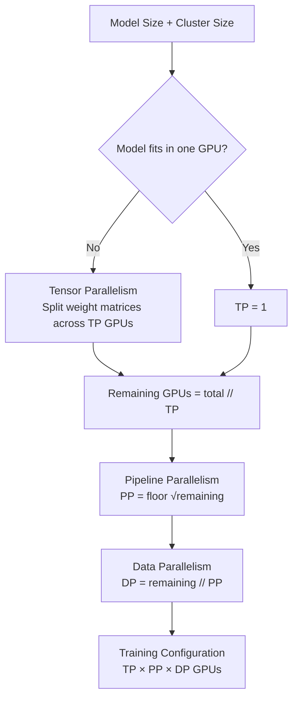
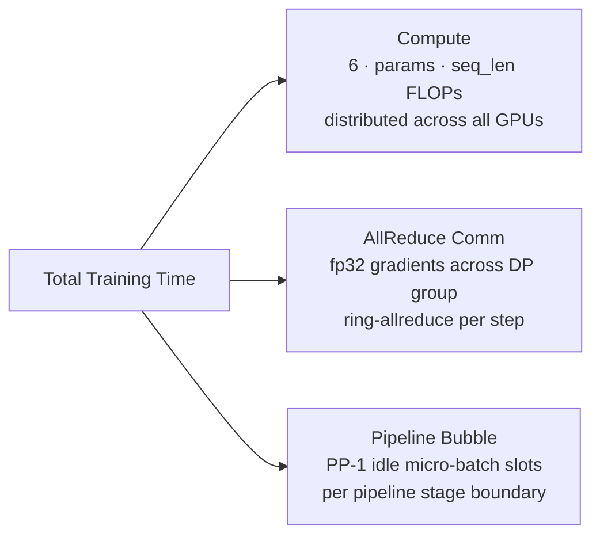
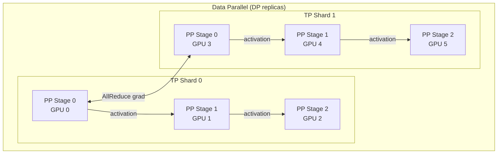

# AI Topology Designer

[](https://github.com/avuppal/ai-topology-designer/actions/workflows/ci.yml)

Tools for planning distributed LLM training deployments. Given a model size, cluster size, and network bandwidth, the toolkit computes the optimal parallelism strategy (Tensor / Pipeline / Data parallel) and estimates wall-clock training time, including AllReduce communication and pipeline-bubble overhead.

---

## Tools

| Script | Purpose |
|---|---|
| `topology_designer.py` | Core library: `memory_footprint`, `optimal_topology`, `est_time` |
| `napkin_solver.py` | Interactive/importable quick estimator returning a `NapkinResult` dataclass |

---

## Parallelism Strategy



---

## Time Estimation

Training time has three components:



---

## Memory Layout



---

## Quick Start

```bash
git clone https://github.com/avuppal/ai-topology-designer.git
cd ai-topology-designer
pip install pytest ruff   # dev tools only; no extra runtime deps needed
```

### Interactive napkin math

```bash
python napkin_solver.py
# Params (e.g. 1e12 for 1T) [1e12]:
# GPUs (e.g. 1000) [1000]:
# Network BW Gbps [400]:
#
# Model       : 1.00T params  (2000.0 GB fp16)
# Cluster     : 1000 H100s
# Parallelism : TP=25  PP=6  DP=6
# Compute     : 0.007 hr
# AllReduce   : 27.307 hr
# PP bubble   : 0.000 hr
# Total       : 27.314 hr
```

### As a library

```python
from napkin_solver import solve

result = solve(params=70e9, gpus=512, bw_gbps=400)
print(result)
# Model       : 0.07T params  (140.0 GB fp16)
# Cluster     : 512 H100s
# Parallelism : TP=2  PP=11  DP=23
# ...
```

```python
from topology_designer import optimal_topology, est_time, memory_footprint

tp, pp, dp = optimal_topology(params=70e9, num_gpus=512)
hours = est_time(70e9, 512, tp, pp, dp, epochs=1, bw_gbps=400)
```

---

## H100 Reference Constants

| Constant | Value | Notes |
|---|---|---|
| HBM per GPU | 80 GB | HBM3 (SXM5) |
| fp16 FLOPS | 1 979 TFLOPS | peak, fwd+bwd |
| Default seq len | 4 096 tokens | — |
| Default BW | 400 Gbps | InfiniBand NDR |

---

## Running Tests

```bash
pytest tests/ -v
# 38 passed in 0.09s
```

---

## Roadmap

- Ring-allreduce comm model with `O((dp-1)/dp)` saturation (current model is linear)
- MoE expert parallelism dimension
- Cost estimator ($/hr) for major cloud providers
- JSON/YAML topology export for cluster provisioning scripts

---

## License

MIT
